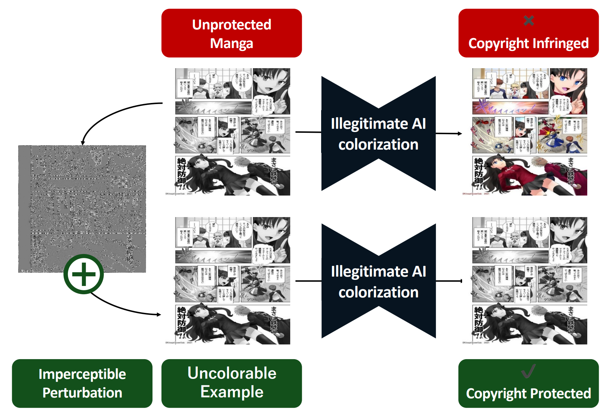

# Uncolorable Examples: PAChroma (APSIPA ASC 2025)

[](https://arxiv.org/abs/2510.08979)
[](http://www.apsipa.org/proceedings/2025/papers/APSIPA2025_P284.pdf)

Official code release for the paper:

**Uncolorable Examples: Preventing Unauthorized AI Colorization via Perception-Aware Chroma-Restrictive Perturbation (PAChroma)**  
*APSIPA ASC 2025 — Best Paper Finalist*

PAChroma defends against **unauthorized automatic image colorization** by generating *Uncolorable Examples*—imperceptibly perturbed grayscale images that neutralize colorization outputs while preserving structure.



---

## Verified Environment
- OS: Ubuntu 24.04.4 LTS (noble)
- Python: 3.10.14
- PyTorch: 2.5.1 (CUDA 12.1 build)
- CUDA (driver): 12.8
- GPU: NVIDIA A100 40GB

> Repro tip: we also provide `environment.yml` (conda) and `requirements.txt` (pip) in this repo.

## Installation

### Option A: Conda (recommended)
```bash
conda env create -f environment.yml
conda activate UncolorableExample
```
### Option B: Conda (recommended)
```bash
python -m venv .venv
source .venv/bin/activate
pip install -U pip
pip install -r requirements.txt
```

## Setup a colorization model (ex : DDColor)
From the repo root:
```bash
git clone https://github.com/piddnad/DDColor.git DDColor
```
Download the weights from the original repository.

## Quick Start
```bash
python PAChroma_DDColor.py --seed 100 --eps_size 16
```
> Defense run on the image inside "Input".
> Protected images and colored images will be saved under the folder "Output"
> note: eps_size=16 corresponds to an L∞ budget of 16/255.

## Citation
```bibtex
@inproceedings{nii2025pachroma,
  title     = {Uncolorable Examples: Preventing Unauthorized AI Colorization via Perception-Aware Chroma-Restrictive Perturbation},
  author    = {Nii, Yuki and Waseda, Futa and Chang, Ching-Chun and Echizen, Isao},
  booktitle = {APSIPA Annual Summit and Conference (APSIPA ASC)},
  year      = {2025}
}
```


